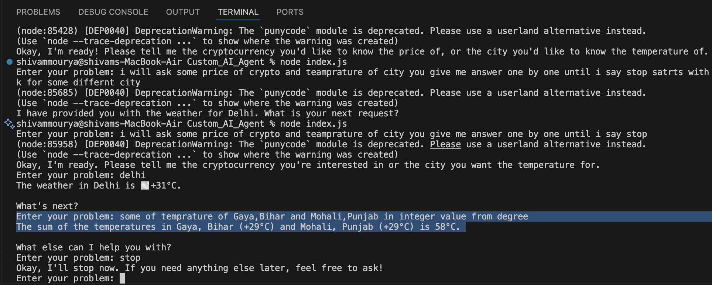

# Custom AI Agent 🤖

A intelligent conversational AI agent that can perform multiple tasks through natural language commands. This project demonstrates how AI agents work in real-world applications by combining language understanding with tool execution capabilities.

## What is Custom AI Agent?

The Custom AI Agent is a conversational AI system that can:
- **Understand natural language** queries from users
- **Execute specific functions** based on user requests
- **Provide real-time information** from multiple data sources
- **Maintain conversation context** throughout the session
- **Handle multiple tool calls** intelligently

Unlike simple chatbots, this AI agent can actually perform actions and fetch live data, making it a practical tool for everyday tasks.

## How AI Agents Work in Real Life

This project is a simplified demonstration of how AI agents operate in production environments:

### Traditional Approach vs AI Agent Approach

**Traditional Way:**
```
User needs crypto price → Opens CoinGecko → Searches Bitcoin → Gets price
User needs weather → Opens weather app → Searches city → Gets temperature
User needs calculation → Opens calculator → Performs math → Gets result
```

**AI Agent Way:**
```
User: "What's the price of Bitcoin and temperature in Delhi?"
Agent: Automatically fetches both pieces of information and responds in natural language
```

### Real-World AI Agent Applications
- **Customer Support**: Agents that can check orders, update accounts, and resolve issues
- **Personal Assistants**: Siri, Alexa, Google Assistant
- **Business Automation**: Agents that can book meetings, send emails, generate reports
- **E-commerce**: Shopping assistants that can search products, compare prices, place orders

## Tools Used 🛠️

### Core Technologies
- **Google Gemini AI**: Advanced language model for natural language understanding and function calling
- **Node.js**: Runtime environment for the application
- **JavaScript ES6+**: Modern JavaScript with async/await support

### APIs Integrated
1. **Weather API**: [wttr.in](https://wttr.in) - Free weather service
   - No API key required
   - Global weather data
   - Simple text format responses

2. **Cryptocurrency API**: [CoinGecko API](https://api.coingecko.com) - Free crypto market data
   - Real-time cryptocurrency prices
   - Market cap and volume data
   - No authentication required

### Additional Features
- **Function Calling**: Advanced AI capability to execute specific functions
- **Conversation Memory**: Maintains context throughout the session
- **Error Handling**: Robust error management for API failures
- **Input Validation**: Ensures proper data handling

## Future Scope 🚀

### Immediate Enhancements
- **Voice Integration**: Add speech-to-text and text-to-speech capabilities
- **Web Interface**: Create a user-friendly web dashboard
- **More APIs**: Integrate news, stocks, sports scores, etc.
- **Scheduling**: Add calendar and reminder functionalities

### Advanced Use Cases

#### For Developers & IT Professionals
```javascript
// Example: DevOps Assistant
"Check server status, deploy latest code to staging, and send Slack notification"
// Agent handles: Server monitoring API + GitHub API + Slack API
```

#### For Business Professionals
```javascript
// Example: Sales Assistant  
"Get quarterly sales data, create presentation slides, and schedule client meeting"
// Agent handles: CRM API + Presentation API + Calendar API
```

#### For Content Creators
```javascript
// Example: Social Media Manager
"Check trending hashtags, generate post content, and schedule across platforms"
// Agent handles: Twitter API + Instagram API + Content Generation + Scheduling
```

#### For E-commerce
```javascript
// Example: Shopping Assistant
"Find best laptop under $1000, compare prices, check reviews, and add to cart"
// Agent handles: Product Search API + Price Comparison + Review API + Shopping Cart
```

### Enterprise Applications
- **API Integration Hub**: Connect 50+ commonly used business APIs
- **Custom Workflows**: Build personalized automation sequences
- **Team Collaboration**: Multi-user support with role-based access
- **Analytics Dashboard**: Track usage patterns and optimize workflows

## Getting Started 🚀

### Prerequisites
- Node.js (v14 or higher)
- Google AI API key (free tier available)

### Installation
```bash
# Clone the repository
git clone https://github.com/shivammourya10/Custom-AI-Agent.git
cd Custom_AI_Agent

# Install dependencies
npm install

# Set up environment variables
echo "GOOGLE_GENAI_API_KEY=your_api_key_here" > .env

# Run the application
node index.js
```

### Usage Examples
```bash
Enter your problem: What's the weather in London?
# Response: London: ☁️ +15°C

Enter your problem: Price of Ethereum
# Response: Ethereum (ETH): $2,456.78 (-2.34%)

Enter your problem: Is 17 a prime number?
# Response: Yes, 17 is a prime number.

Enter your problem: Sum of 45 and 67
# Response: 112

Enter your problem: stop
# Goodbye! Thanks for using the AI agent.
```

## In Action 📸

### Demo Screenshots
 
#### Conversation Flow
```
🤖 AI Agent Demo

Enter your problem: I need weather for Mumbai and Bitcoin price
AI: The weather in Mumbai is ☀️ +32°C
    Bitcoin (BTC): $43,250.67 

Enter your problem: What's 25 + 75?
AI: 100

Enter your problem: Is 29 prime?
AI: Yes, 29 is a prime number.

Enter your problem: stop
AI: Goodbye! Thanks for using the AI agent.
```

#### Multi-Tool Usage Example
```
User: "Compare temperature of Delhi vs Mumbai, then tell me Ethereum price"

Agent Process:
1. 🌡️ Fetches Delhi weather: +31°C
2. 🌡️ Fetches Mumbai weather: +28°C  
3. 💰 Fetches Ethereum price: $2,456.78
4. 📊 Provides comparative analysis

Response: "Delhi is warmer at +31°C compared to Mumbai at +28°C. 
Ethereum is currently trading at $2,456.78."
```

## Contributing 🤝

We welcome contributions! Here's how you can help:

1. **Add New APIs**: Integrate more useful APIs (news, sports, stocks, etc.)
2. **Improve Error Handling**: Better error messages and fallback mechanisms  
3. **Add Features**: Voice support, web interface, scheduling, etc.
4. **Documentation**: Improve setup guides and usage examples
5. **Testing**: Add comprehensive test coverage

### Development Setup
```bash
# Fork the repository
git fork https://github.com/shivammourya10/Custom-AI-Agent.git

# Create feature branch
git checkout -b feature/new-api-integration

# Make changes and test 

# Submit pull request
git push origin feature/new-api-integration
```

## Support 💬

- 📧 Email: mouryas318@gmail.com
- X x.com: [Connect](https://x.com/Shivammourya318)
---

**Made with ❤️ by Shivam Mourya**
# Happy Learning💫

> "The future belongs to those who can seamlessly blend human creativity with AI capabilities"
